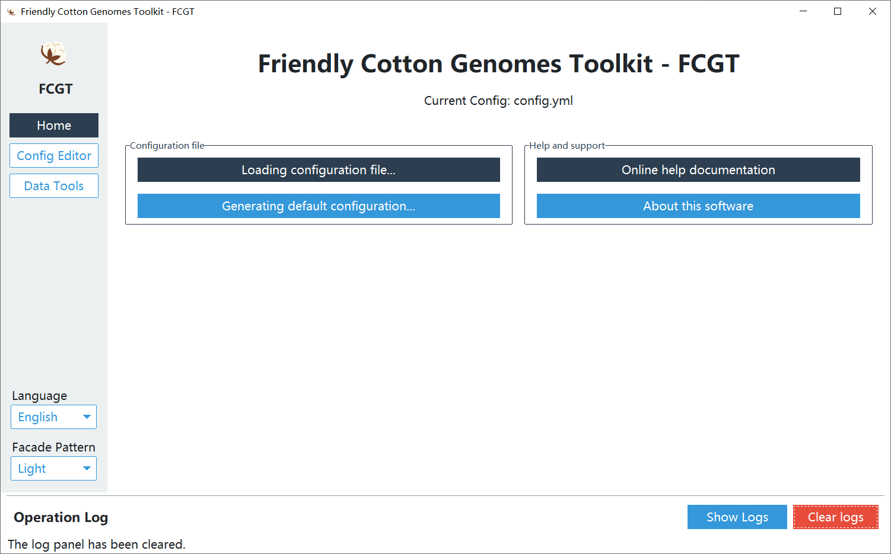

<div align="center">  <h1 style="font-weight:700; letter-spacing:1px; margin-bottom:0;"> フレンドリーコットンゲノムツールキット (FCGT) </h1> <p> <a href="https://github.com/PureAmaya/Friendly-Cotton-Genomes-Toolkit/releases"></a> <a href="https://github.com/PureAmaya/Friendly-Cotton-Genomes-Toolkit/blob/master/LICENSE"></a> </p> </div>

## 选择你的语言 | Select your language | 言語を選択 | 選擇語言

[中文（简体）](../README.md) | [English](README_en.md) | [日本語](README_ja.md) | [繁體中文](README_zh-hant.md)

## 🚀 プロジェクト概要

**FCGT (Friendly Cotton Genomes Toolkit)** は、綿の研究者、特に**バイオインフォマティクスの専門知識を持たない**研究者や学生向けに設計されたゲノムデータ解析ツールキットです。複雑なデータ処理フローをシンプルなグラフィカルユーザーインターフェース（GUI）とコマンドラインインターフェース（CLI）の背後にカプセル化し、面倒な環境設定やコーディングなしで**すぐに使える**ようにすることを目指しています。

このツールキットは、異なるバージョン間の相同遺伝子マッピング（Liftover）、遺伝子機能アノテーション、遺伝子座クエリ、エンリッチメント解析、AIアシスタントによるバッチデータ処理など、強力な綿ゲノムデータ処理ツールを提供します。日常の研究業務において不可欠で、**安定して信頼できる**強力なアシスタントとなることを目指しています。

## ✨ 主な特徴と機能

### 1. 究極の使いやすさ、すぐに使える

- **データセキュリティ**: データダウンロード、AI機能、アップデートチェックを除き、全プロセスでインターネット接続は不要で、データ漏洩を防ぎます。ソースコードはオープンソースであり、コミュニティによるレビューを受け入れています。
- **GUI優先**: すべてのコアツールは直感的なグラフィカルインターフェースを通じて操作でき、マウスクリックだけで解析を実行できます。
- **インタラクティブなタスクフィードバック**: **時間のかかるすべての操作（データダウンロード、AI処理など）にはリアルタイムのプログレスバーが表示され、いつでもタスクをキャンセルできます。タスク完了後には成功、失敗、またはキャンセルの明確な通知が表示され、待つだけの時間をなくします。**
- **スムーズな操作体験**: **最適化されたUIロジックにより、インターフェースの切り替えが瞬時に反応し、全ページでスムーズなマウスホイールスクロールが保証され、ネイティブデスクトップアプリケーションに匹敵する体験を提供します。**
- **多言語対応**: 簡体/繁体中国語、英語、日本語のインターフェースを内蔵し、言語の壁を取り払います。

### 2. 効率的な自動化とバッチ処理

- **強力な並行処理とタスク管理**: 内蔵のマルチスレッドにより、大量のゲノムデータのダウンロードや、AIアシスタントを使用した数千行のテーブルのバッチ処理など、待ち時間を大幅に短縮します。インタラクティブなプログレスポップアップにより、タスクのステータスを常に把握し、いつでもキャンセルできます。
- **スマートな設定同期**: 設定エディタで行った変更（AIモデルの変更など）は、再起動や手動リフレッシュなしにすべての機能ページにリアルタイムで同期され、見たままがそのまま反映されます。
- **コマンドラインサポート**: 上級ユーザー向けに、機能豊富なコマンドラインツールも提供しており、FCGTを自動解析フローに簡単に統合できます。

### 3. 高精度なゲノムツールセット

- **綿用Liftover**: 綿の研究分野で長年問題となっていた、異なるゲノムバージョン間で遺伝子リストを変換するツールの欠如を解決しました。
- **オールインワンデータツール**: 遺伝子アノテーション、GFFクエリ、エンリッチメント解析、フォーマット変換など、よく使われる機能を多数統合しており、複数のソフトウェアを切り替える必要がありません。
- **標準化されたデータダウンロード**: [CottonGen](https://www.cottongen.org/) などの権威あるデータベースから、主要な綿のリファレンスゲノムとアノテーションファイルをワンクリックでダウンロードできます。

### 4. クロスプラットフォーム、どこでも利用可能

- **Windows** ユーザー向けにプリコンパイル済みの実行可能ファイルを提供しています（他のシステムのユーザーはPythonから実行できます）。
- どの主要なオペレーティングシステムを使用していても、一貫したスムーズな使用体験を得られます。

## クイックスタート

[**リリース**](https://github.com/PureAmaya/Friendly-Cotton-Genomes-Toolkit/releases) ページで、すぐに使える実行可能ファイルを用意しています。これが最も推奨される使用方法です。

- **GUI版**: `FCGT-GUI.exe` (Windows) またはお使いのシステムに対応するファイルをダウンロードし、ダブルクリックして実行します。
- **コマンドラインツール**: `FCGT.exe` (Windows) またはお使いのシステムに対応するファイルをダウンロードし、ターミナルで実行します。

**開発者や上級ユーザー**は、ソースコードから起動することもできます：

```
# GUIを実行
pixi run start

# パッケージングプログラム
pixi run build
```

## スクリーンショットプレビュー




## 謝辞と引用

### 開発と謝辞

- **スペシャルサンクス**: このプロジェクトの開発は、**オープンソースコミュニティ**と、綿の研究に貢献したすべての**研究者**の支援によって支えられています。

### 著作権とライセンス

このツールの開発には、以下の優れたオープンソースパッケージが使用されています。開発者の皆様に感謝いたします。

| **ライブラリ**          | **主な用途**                                                 | **オープンソースライセンス**                       |
| ----------------------- | ------------------------------------------------------------ | -------------------------------------------------- |
| **pydantic**            | データ検証、設定管理、型ヒントの強制に使用。プロジェクトの設定モデルの中核。 | MIT License                                        |
| **typing-extensions**   | 標準の `typing` モジュールに新しい、または実験的な型ヒントのサポートを提供。 | Python Software Foundation License                 |
| **packaging**           | Pythonパッケージのバージョン、マーカー、仕様の処理に使用。   | Apache-2.0 / BSD                                   |
| **requests**            | エレガントでシンプルなHTTPライブラリ。データのダウンロードなどのネットワークリクエストを実行するために使用。 | Apache-2.0 License                                 |
| **tqdm**                | 高速で拡張可能なプログレスバーツール。コマンドラインやループで進捗を表示するために使用。 | MIT License                                        |
| **gffutils**            | GFF/GTFファイルデータベースの作成、管理、クエリに使用。ゲノムアノテーション操作の基盤。 | MIT License                                        |
| **pandas**              | 高性能で使いやすいデータ構造とデータ分析ツールを提供。すべてのデータ処理の中核。 | BSD 3-Clause License                               |
| **pyyaml**              | YAMLファイルの解析に使用。`config.yml` 設定ファイルの読み込みに不可欠。 | MIT License                                        |
| **google-generativeai** | Geminiなどの生成AIモデルと対話するためのGoogleの公式ライブラリ。 | Apache-2.0 License                                 |
| **numpy**               | Python科学計算の基本パッケージ。Pandasなどのライブラリに多次元配列オブジェクトと数学的演算サポートを提供。 | BSD 3-Clause License                               |
| **customtkinter**       | モダンで美しいグラフィカルユーザーインターフェース（GUI）の構築に使用。 | MIT License                                        |
| **pillow**              | Pillow (PIL Fork) は、GUIでアイコンなどの画像を読み込んで表示するための強力な画像処理ライブラリ。 | Historical Permission Notice and Disclaimer (HPND) |
| **diskcache**           | ディスクベースのキャッシュ機能を提供し、一時的または再利用可能なデータを保存してパフォーマンスを向上させるために使用。 | Apache-2.0 License                                 |
| **click**               | 構成可能な方法で美しいコマンドラインインターフェース（CLI）を作成するために使用。 | BSD 3-Clause License                               |
| **matplotlib**          | Pythonで静的、アニメーション、インタラクティブな視覚化を作成するための包括的なライブラリ。 | matplotlib License (BSD-style)                     |
| **statsmodels**         | さまざまな統計モデルの推定、統計的検定の実施、データ探索のためのクラスと関数を提供。 | BSD 3-Clause License                               |
| **protobuf**            | Googleのデータ交換フォーマット。他のライブラリ（TensorFlowや一部のAPIクライアントなど）に依存されることが多い。 | BSD 3-Clause License                               |
| **openpyxl**            | Excel 2010 xlsx/xlsm/xltx/xltm ファイルの読み書きに使用するライブラリ。 | MIT License                                        |
| **networkx**            | 複雑なネットワークの構造、ダイナミクス、機能を作成、操作、研究するためのPythonパッケージ。 | BSD 3-Clause License                               |
| **upsetplot**           | UpSetプロットを生成するために使用。集合の共通部分を視覚化するための効果的な方法。 | BSD 3-Clause License                               |

### データソースと引用

このツールは [CottonGen](https://www.cottongen.org/) が提供する権威あるデータに依存しています。そのチームの継続的な公開とメンテナンスに感謝します。

- **CottonGen 論文**:
  - Yu, J, Jung S, et al. (2021) CottonGen: The Community Database for Cotton Genomics, Genetics, and Breeding Research. *Plants* 10(12), 2805.
  - Yu J, Jung S, et al. (2014) CottonGen: a genomics, genetics and breeding database for cotton research. *Nucleic Acids Research* 42(D1), D1229-D1236.
- **ゲノム引用文献**:
  - **NAU-NBI_v1.1**: Zhang et. al., [Sequencing of allotetraploid cotton (Gossypium hirsutum L. acc. TM-1) provides a resource for fiber improvement](http://www.nature.com/nbt/journal/v33/n5/full/nbt.3207.html). *Nature Biotechnology*. 33, 531–537. 2015
  - **UTX-JGI-Interim-release_v1.1**:
    - Haas, B.J., Delcher, A.L., Mount, S.M., Wortman, J.R., Smith Jr, R.K., Jr., Hannick, L.I., Maiti, R., Ronning, C.M., Rusch, D.B., Town, C.D. et al. (2003) Improving the Arabidopsis genome annotation using maximal transcript alignment assemblies. http://nar.oupjournals.org/cgi/content/full/31/19/5654 [Nucleic Acids Res, 31, 5654-5666].
    - Smit, AFA, Hubley, R & Green, P. RepeatMasker Open-3.0. 1996-2011 .
    - Yeh, R.-F., Lim, L. P., and Burge, C. B. (2001) Computational inference of homologous gene structures in the human genome. Genome Res. 11: 803-816.
    - Salamov, A. A. and Solovyev, V. V. (2000). Ab initio gene finding in Drosophila genomic DNA. Genome Res 10, 516-22.
  - **HAU_v1 / v1.1**: Wang *et al.* [Reference genome sequences of two cultivated allotetraploid cottons, Gossypium hirsutum and Gossypium barbadense.](https://www.nature.com/articles/s41588-018-0282-x) *Nature genetics*. 2018 Dec 03
  - **ZJU-improved_v2.1_a1**: Hu et al. Gossypium barbadense and Gossypium hirsutum genomes provide insights into the origin and evolution of allotetraploid cotton. *Nature genetics*. 2019 Jan;51(1):164.
  - **CRI_v1**: [Yang Z, Ge X, Yang Z, Qin W, Sun G, Wang Z, Li Z, Liu J, Wu J, Wang Y, Lu L, Wang P, Mo H, Zhang X, Li F. Extensive intraspecific gene order and gene structural variations in upland cotton cultivars. Nature communications. 2019 Jul 05; 10(1):2989.](https://www.cottongen.org/bio_data/16035)
  - **WHU_v1**: Huang, G. *et al*., Genome sequence of *Gossypium herbaceum* and genome updates of *Gossypium arboreum* and *Gossypium hirsutum* provide insights into cotton A-genome evolution. Nature Genetics. 2020. [doi.org/10.1038/s41588-020-0607-4](https://doi.org/10.1038/s41588-020-0607-4)
  - **UTX_v2.1**: [Chen ZJ, Sreedasyam A, Ando A, Song Q, De Santiago LM, Hulse-Kemp AM, Ding M, Ye W, Kirkbride RC, Jenkins J, Plott C, Lovell J, Lin YM, Vaughn R, Liu B, Simpson S, Scheffler BE, Wen L, Saski CA, Grover CE, Hu G, Conover JL, Carlson JW, Shu S, Boston LB, Williams M, Peterson DG, McGee K, Jones DC, Wendel JF, Stelly DM, Grimwood J, Schmutz J. Genomic diversifications of five Gossypium allopolyploid species and their impact on cotton improvement. Nature genetics. 2020 Apr 20.](https://www.cottongen.org/bio_data/13714)
  - **HAU_v2.0**: Chang, Xing, Xin He, Jianying Li, Zhenping Liu, Ruizhen Pi, Xuanxuan Luo, Ruipeng Wang et al. "[High-quality Gossypium hirsutum and Gossypium barbadense genome assemblies reveal the landscape and evolution of centromeres](https://www.cottongen.org/bio_data/9803222)." Plant Communications 5, no. 2 (2024). [doi.org/10.1016/j.xplc.2023.100722](https://doi.org/10.1016/j.xplc.2023.100722)

> **免責事項**：上記のゲノムデータのダウンロードと処理はユーザーが実行するものであり、このツールはフレームワークサービスのみを提供します。

## フィードバックと交流

ご提案、ご質問、または協力のご意向がございましたら、[**GitHub Issues**](https://github.com/PureAmaya/Friendly-Cotton-Genomes-Toolkit/issues) を通じてお気軽にお問い合わせください。同業者からのご批判やご指摘を歓迎し、より良いオープンソースツールエコシステムを共に構築していきましょう！